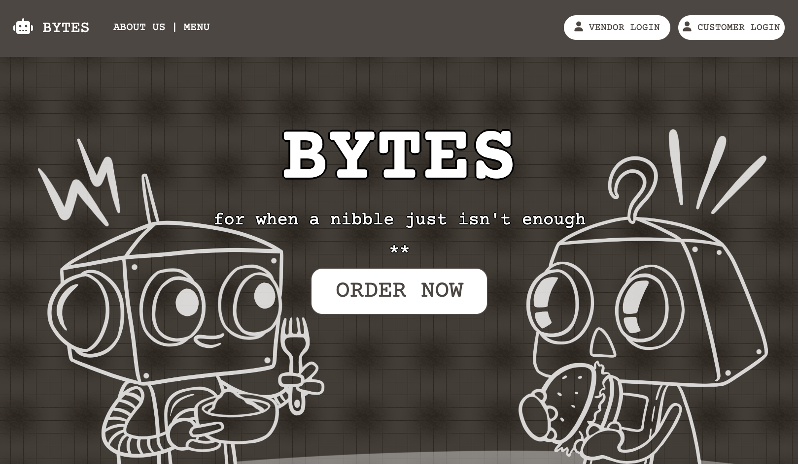
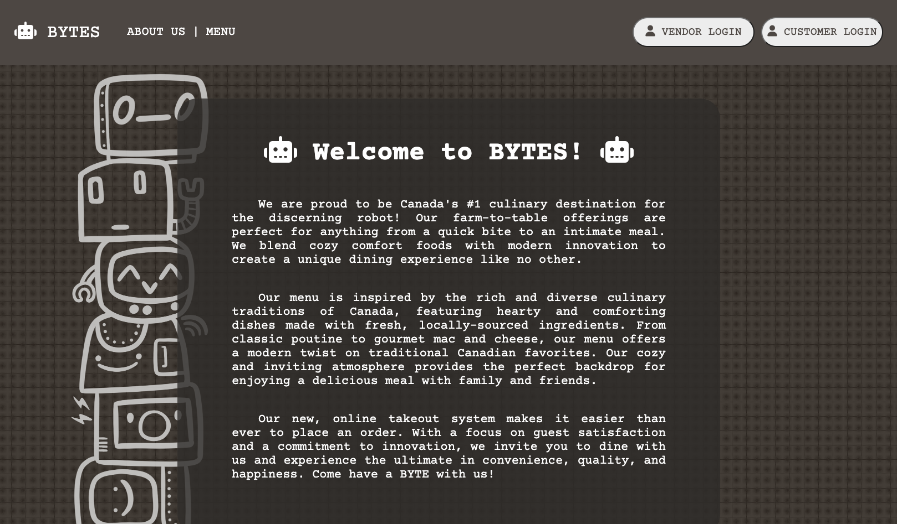
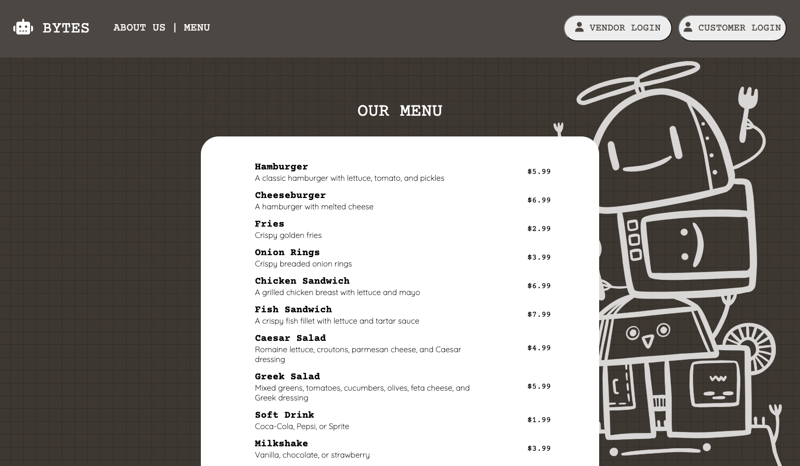
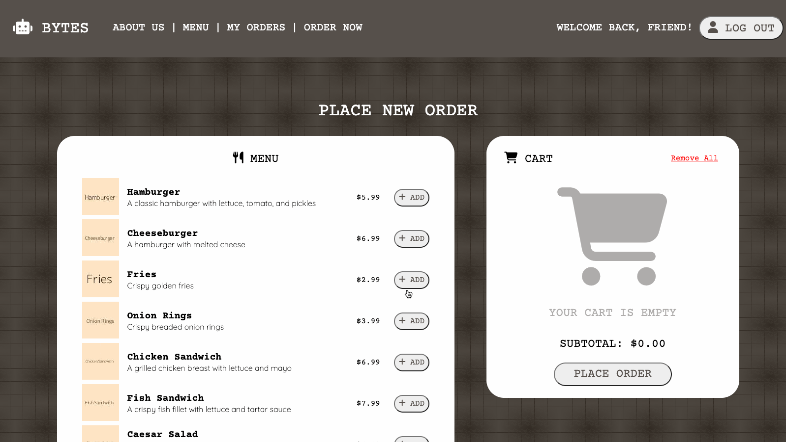
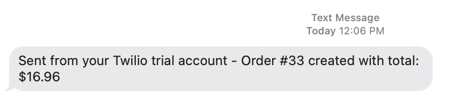
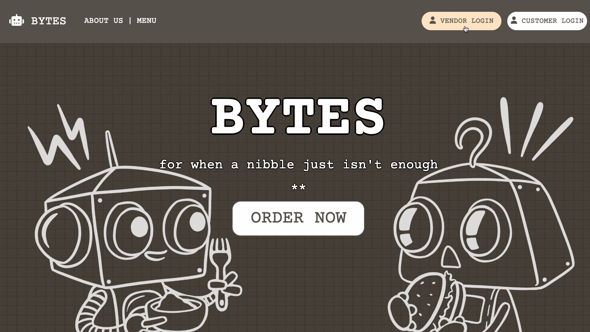
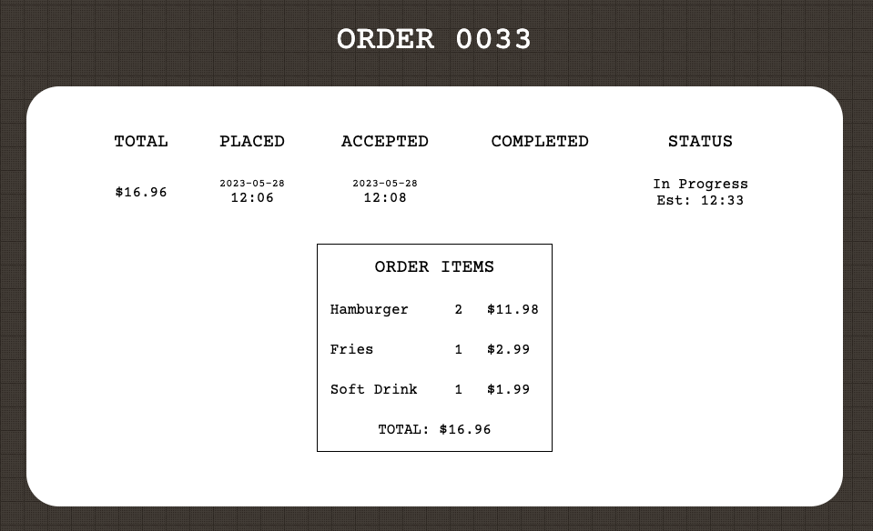
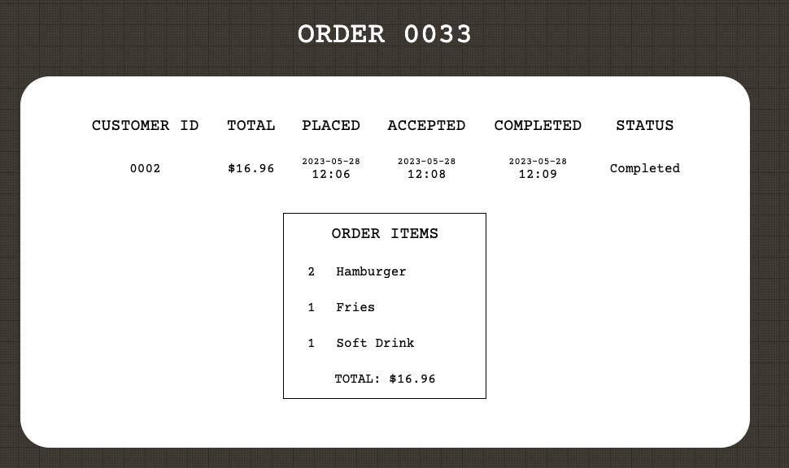

## Midterm Project: Bytes Restaurant 🤖

A web app for a fictional robot-themed restaurant! Customers are able to place take-out orders for pickup, and the restaurant can accept and mark orders as completed. All with text notifications via Twilio!

## Contributors

- [Sabrina Wang](https://github.com/penguinboots) : front-end, design/art 🌸
- [Khalil Mubarak](https://github.com/MediumChaiLatte2Sugars): back-end 💻
- [Pauline Revilla](https://github.com/mzparulina): database 💾

## Main Features

### Customers
- add various menu items to cart
- place order
- view existing and past orders (with dates/timestamps and statuses)
- gets text notifications upon order acceptance (with time estimate), rejection, and/or completion

### Restaurant
- can view existing and past orders (with dates/timestamps and statuses)
- can accept pending orders and give estimated pick-up time
- can mark "in progress" orders as completed (sending an updated text to customer)
- gets text notifications upon receiving new order, and confirmation text for rejecting order

### Features for the future
- user authentication for both vendor and customer accounts
- menu management for vendor (add, edit, delete menu items)
- replace placeholder content (menu items and images, text blurbs)

## Final Product

#### Home

#### About

#### Menu

#### Cart Functions / Placing an Order

#### Text to Restaurant

#### Restaurant Accepts Order

#### Order Status View (Customer)

#### Texts to Customer

#### Order Status View After Completion (Restaurant)

## Dependencies
- bcrypt: ^5.1.0
- body-parser: ^1.20.2
- chalk:  ^2.4.2
- cookie-parser: ^1.4.6
- cookie-session: ^2.0.0
- dotenv: ^2.0.0
- ejs: ^2.6.2
- express: ^4.17.1
- morgan: ^1.9.1
- pg: ^8.5.0
- sass: ^1.35.1

## Dev Dependencies
- nodemon: ^2.0.10
- twilio: ^4.8.0

## Setup

1. Clone this repo
2. Create the `.env` according to `.env.example`
    - local information provided:
        - username: `labber`
        - password: `labber`
        - database: `midterm`
    - information required - [Twilio](https://www.twilio.com/en-us):
        - Twilio Account SID
        - Twilio Auth Token
        - Twilio Number
        - Client Number
3. Install dependencies: `npm install`
4. Fix to binaries for sass: `npm rebuild node-sass`
5. Reset the database: `npm run db:reset`
6. Run the server: `npm run local` or `npm run start`
7. Visit `http://localhost:8080/`
